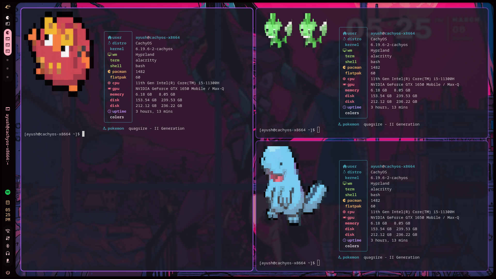

# 🎮 Fastfetch-Pokemon

> Because staring at boring system info wasn't enough — now your terminal has opinions about which starter is best.

A setup that integrates **Fastfetch** with **pokimg** to display a random Pokémon sprite alongside your system information every time you open a terminal. You know, like a normal person.

---

<div style="display:flex;gap:16px;flex-wrap:wrap; height=500px; width=1000px; display:flex-column">





</div>


---

## 🧰 Requirements

Before you embarrass yourself by blindly copy-pasting commands, make sure you have these:

- **Fastfetch** — the system info fetcher (not neofetch, we've evolved)
- **pokimg** — the script that renders Pokémon sprites in your terminal (included in this repo)
- A terminal emulator that supports **image rendering** (Kitty, iTerm2, WezTerm — basically anything that isn't your grandpa's xterm)
- A Linux/macOS system (Windows users: I'm so sorry)

---

## ⚙️ Installation

### 1. Clone the repo

```bash
git clone https://github.com/ayushgatla/Fastfetch-Pokemon.git
cd Fastfetch-Pokemon
```

### 2. Install Fastfetch

```bash
# Ubuntu/Debian
sudo apt install fastfetch

# Arch (you already know)
sudo pacman -S fastfetch

# macOS
brew install fastfetch
```

### 3. Set up pokimg

`pokimg` is the script that actually fetches and renders the Pokémon sprite in your terminal. It's included in this repo.

Make it executable and move it somewhere in your PATH:

```bash
chmod +x pokimg
```

> **Note:** `pokimg` requires your terminal to support the **Kitty graphics protocol** or **iTerm2 image protocol**. If your terminal renders a wall of garbled escape codes, that's your terminal's fault, not yours. (Switch to Kitty.)

### 4. Copy Fastfetch config

The `fastfetch/` folder contains the config that tells Fastfetch how to lay out your system info. Drop it in the right place:

```bash
mkdir -p ~/.config/fastfetch
cp fastfetch/* ~/.config/fastfetch/
```

### 5. Update your shell config

Open `bashrc.txt` from this repo — it contains the magic one-liner that ties everything together. Add it to your `~/.bashrc` (or `~/.zshrc` if you're fancy):

```bash
cat bashrc.txt >> ~/.bashrc
source ~/.bashrc
```
```bash
nano ~/.bashrc

then edit the {username} in the POKIMG_PATH to you username
also make sure to use kitty as your terminal

POKIMG_PATH="/home/{username}/Fastfetch-Pokemon"
OUTPUT=$(python3 $POKIMG_PATH/random_pokemon.py)
POKEMON=$(echo $OUTPUT | awk '{print $1}')
echo "$OUTPUT" >/tmp/pokemon_name.txt

fastfetch \
  --logo "$POKIMG_PATH/images/$POKEMON.png" \
  --logo-type kitty-direct \
  --logo-width 30 \
  --logo-height 15 \
  --config ~/.config/fastfetch/config.jsonc
```
#edit your fastfetch config
nano .config/fastfetch/config.jsonc
```bash


{
  "$schema": "https://github.com/fastfetch-cli/fastfetch/raw/dev/doc/json_schema.json",

  "display": {
    "separator": " ",
    "size": {
      "maxPrefix": "GB",
      "spaceBeforeUnit": "always",
      "binaryPrefix": "si"
    }
  },

  "modules": [
    {
      "type": "custom",
      "format": "\n"
    },

    {
      "type": "custom",
      "key": "╭─────────────────╮"
    },

    {
      "type": "title",
      "key": "│  user          │",
      "format": "{user-name-colored}@{host-name-colored}"
    },

    {
      "type": "os",
      "key": "│  distro        │",
      "format": "{pretty-name}"
    },

    {
      "type": "kernel",
      "key": "│ 󰒋 kernel        │",
      "format": "{release}"
    },

    {
      "type": "wm",
      "key": "│ 󰖲 wm            │",
      "format": "{pretty-name}"
    },

    {
      "type": "terminal",
      "key": "│  terminal      │",
      "format": "{pretty-name}"
    },

    {
      "type": "shell",
      "key": "│  shell         │",
      "format": "{pretty-name}"
    },

    {
      "type": "packages",
      "key": "│ 󰏖 pacman        │",
      "format": "{pacman}"
    },

    {
      "type": "packages",
      "key": "│ 󰏖 flatpak       │",
      "format": "{flatpak-system}"
    },

    {
      "type": "cpu",
      "key": "│ 󰍛 cpu           │",
      "format": "{name}"
    },

    {
      "type": "gpu",
      "key": "│ 󰢮 gpu           │",
      "hideType": "integrated",
      "format": "{name}"
    },

    {
      "type": "memory",
      "key": "│ 󰑭 memory        │",
      "format": "{used} / {total}"
    },

    {
      "type": "disk",
      "key": "│ 󰋊 disk          │",
      "format": "{size-used} / {size-total}"
    },

    {
      "type": "uptime",
      "key": "│ 󰅐 uptime        │"
    },

    {
      "type": "custom",
      "key": "│  colors        │",
      "format": "\u001b[90m  \u001b[31m  \u001b[32m  \u001b[33m  \u001b[34m  \u001b[35m  \u001b[36m  \u001b[37m"
    },

    {
      "type": "custom",
      "key": "╰─────────────────╯"
    },

    {
      "type": "command",
      "key": "󰐠 pokemon",
      "text": "cat /tmp/pokemon_name.txt"
    }
  ]
}


```


This will run `pokimg` + `fastfetch` every time you open a new terminal session. Yes, every time. You will see Pokémon before you see your actual work. This is the way.

---

## 🔧 How It Works

Here's the chain of events when you open a terminal, explained for people who like to know things:

1. Your shell starts and hits the command(s) in `.bashrc`
2. `pokimg` is called — it picks a **random Pokémon**, fetches its sprite, and renders it using your terminal's image protocol
3. `fastfetch` runs its thing and displays your CPU, RAM, OS, uptime, and other info you'll never actually act on
4. The sprite and system info appear side by side (or stacked, depending on config)
5. You feel 40% more productive having done absolutely nothing

---

## 🎨 Customization

### Change Fastfetch layout
Edit `~/.config/fastfetch/config.jsonc` to add/remove/reorder info modules. The [Fastfetch wiki](https://github.com/fastfetch-cli/fastfetch/wiki) has every option documented.

### Lock a specific Pokémon
If you're deeply committed to one Pokémon (valid), you can modify the `pokimg` call in your `.bashrc` to pass a specific Pokémon name or ID instead of letting it be random. Check `pokimg --help` for available flags.

### Terminal compatibility
If images aren't rendering:
- **Kitty**: Should work out of the box
- **iTerm2**: Enable *"Allow apps to write to pasteboard"* and image display in settings
- **WezTerm**: Enable the `ImgProtocol` config option
- **Everything else**: You're on your own, champ

---

## 🗂️ Repo Structure

```
Fastfetch-Pokemon/
├── Showcase/        # Screenshots of the setup in action
├── fastfetch/       # Fastfetch config files
├── pokimg           # The Pokémon image rendering script
└── bashrc.txt       # Shell snippet to wire it all together
```

---

## 🐛 Troubleshooting

| Problem | Likely Cause | Fix |
|--------|-------------|-----|
| No image, just symbols | Terminal doesn't support image protocol | Switch to Kitty or iTerm2 |
| `pokimg: command not found` | Not in PATH | Move it to `/usr/local/bin/` |
| Fastfetch not found | Not installed | Install it (see above) |
| Image and text overlapping weirdly | Config needs tweaking | Adjust spacing in fastfetch config |
| It works but Mewtwo never shows up | Pure statistical tragedy | Keep opening terminals |

---

## 🙏 Credits

- [Fastfetch](https://github.com/fastfetch-cli/fastfetch) — for being a genuinely great neofetch replacement
- [pokimg](https://github.com/FuzzyGrim/pokimg) (or whichever flavor) — for making terminals inexplicably better
- You — for having the taste to want Pokémon in your terminal

---

*"It's not procrastination if your terminal looks sick while you do it."*
